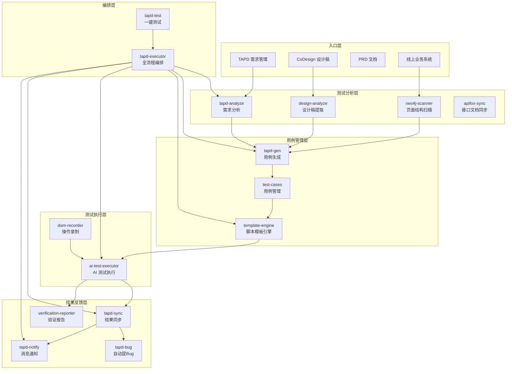

# Skills 整体架构图

```mermaid
graph TB
    subgraph 入口层
        TAPD[TAPD 需求管理]
        CoDesign[CoDesign 设计稿]
        PRD[PRD 文档]
        SYSTEM[线上业务系统]
    end

    subgraph 测试分析层
        TA[tapd-analyze<br/>需求分析]
        DA[design-analyze<br/>设计稿提取]
        NS[neo4j-scanner<br/>页面结构扫描]
        AP[apifox-sync<br/>接口文档同步]
    end

    subgraph 用例管理层
        TC[test-cases<br/>用例管理]
        TG[tapd-gen<br/>用例生成]
        TE[template-engine<br/>脚本模板引擎]
    end

    subgraph 测试执行层
        AE[ai-test-executor<br/>AI 测试执行]
        DR[dom-recorder<br/>操作录制]
    end

    subgraph 结果反馈层
        TS[tapd-sync<br/>结果同步]
        TB[tapd-bug<br/>自动提Bug]
        TN[tapd-notify<br/>消息通知]
        VR[verification-reporter<br/>验证报告]
    end

    subgraph 编排层
        TX[tapd-executor<br/>全流程编排]
        TT[tapd-test<br/>一键测试]
    end

    %% 数据流
    TAPD --> TA
    CoDesign --> DA
    SYSTEM --> NS
    TA --> TG
    DA --> TG
    NS --> TG
    TG --> TC
    TC --> TE
    TE --> AE
    DR --> AE
    AE --> TS
    TS --> TB
    TS --> TN
    AE --> VR
    TX --> TA
    TX --> TG
    TX --> TE
    TX --> AE
    TX --> TS
    TX --> TN
    TT --> TX
```
