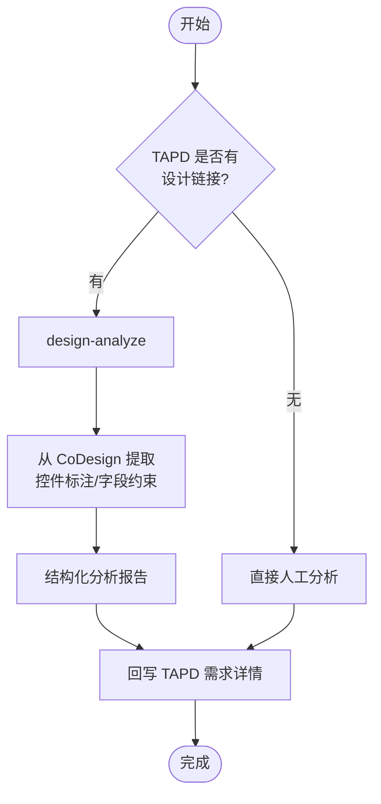
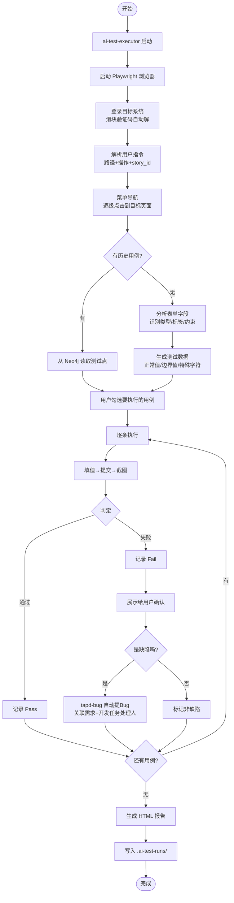
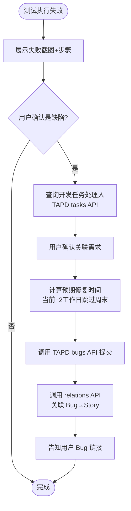
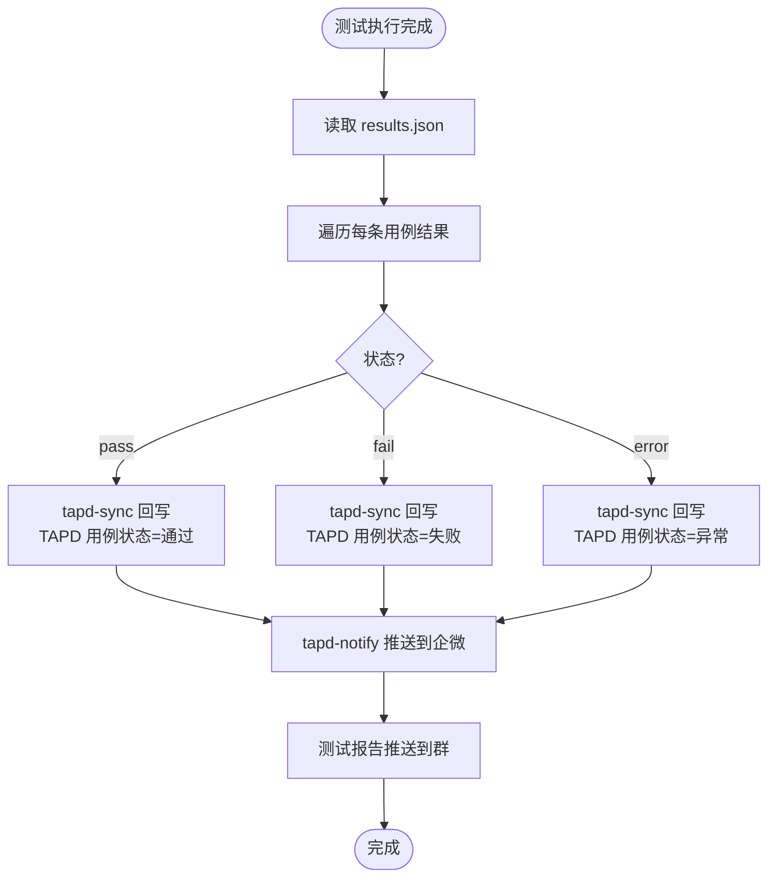
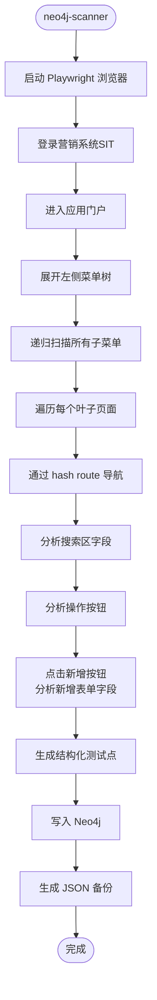

# Skills 流程图

## 一、需求分析流程图

```mermaid
graph TD
    START([开始]) --> A{TAPD 是否有<br/>设计链接?}
    A -->|有| B[design-analyze]
    A -->|无| C[直接人工分析]
    B --> D[从 CoDesign 提取<br/>控件标注/字段约束]
    D --> E[结构化分析报告]
    E --> F[回写 TAPD 需求详情]
    C --> F
    F --> END([完成])
```

## 二、测试执行流程图

```mermaid
graph TD
    START([开始]) --> A[ai-test-executor 启动]
    A --> B[启动 Playwright 浏览器]
    B --> C[登录目标系统<br/>滑块验证码自动解]
    C --> D[解析用户指令<br/>路径+操作+story_id]
    D --> E[菜单导航<br/>逐级点击到目标页面]
    E --> F{有历史用例?}
    F -->|有| G[从 Neo4j 读取测试点]
    F -->|无| H[分析表单字段<br/>识别类型/标签/约束]
    H --> I[生成测试数据<br/>正常值/边界值/特殊字符]
    G --> J[用户勾选要执行的用例]
    I --> J
    J --> K[逐条执行]
    K --> L[填值→提交→截图]
    L --> M{判定}
    M -->|通过| N[记录 Pass]
    M -->|失败| O[记录 Fail]
    O --> P[展示给用户确认]
    P --> Q{是缺陷吗?}
    Q -->|是| R[tapd-bug 自动提Bug<br/>关联需求+开发任务处理人]
    Q -->|否| S[标记非缺陷]
    N --> T{还有用例?}
    R --> T
    S --> T
    T -->|有| K
    T -->|无| U[生成 HTML 报告]
    U --> V[写入 .ai-test-runs/]
    V --> END([完成])
```

## 三、Bug 提交流程图

```mermaid
graph TD
    START([测试执行失败]) --> A[展示失败截图+步骤]
    A --> B{用户确认是缺陷?}
    B -->|否| END
    B -->|是| C[查询开发任务处理人<br/>TAPD tasks API]
    C --> D[用户确认关联需求]
    D --> E[计算预期修复时间<br/>当前+2工作日跳过周末]
    E --> F[调用 TAPD bugs API 提交]
    F --> G[调用 relations API<br/>关联 Bug→Story]
    G --> H[告知用户 Bug 链接]
    H --> END([完成])
```

## 四、结果同步流程图

```mermaid
graph TD
    START([测试执行完成]) --> A[读取 results.json]
    A --> B[遍历每条用例结果]
    B --> C{状态?}
    C -->|pass| D[tapd-sync 回写<br/>TAPD 用例状态=通过]
    C -->|fail| E[tapd-sync 回写<br/>TAPD 用例状态=失败]
    C -->|error| F[tapd-sync 回写<br/>TAPD 用例状态=异常]
    D --> G[tapd-notify 推送到企微]
    E --> G
    F --> G
    G --> H[测试报告推送到群]
    H --> END([完成])
```

## 五、页面扫描流程图

```mermaid
graph TD
    START([neo4j-scanner]) --> A[启动 Playwright 浏览器]
    A --> B[登录营销系统SIT]
    B --> C[进入应用门户]
    C --> D[展开左侧菜单树]
    D --> E[递归扫描所有子菜单]
    E --> F[遍历每个叶子页面]
    F --> G[通过 hash route 导航]
    G --> H[分析搜索区字段]
    H --> I[分析操作按钮]
    I --> J[点击新增按钮<br/>分析新增表单字段]
    J --> K[生成结构化测试点]
    K --> L[写入 Neo4j]
    L --> M[生成 JSON 备份]
    M --> END([完成])
```
