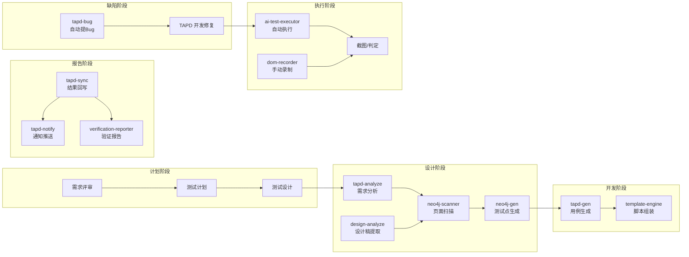
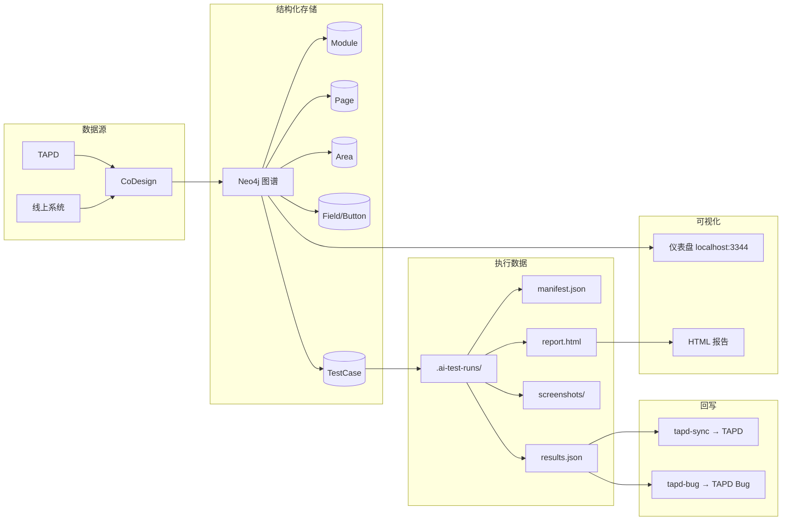
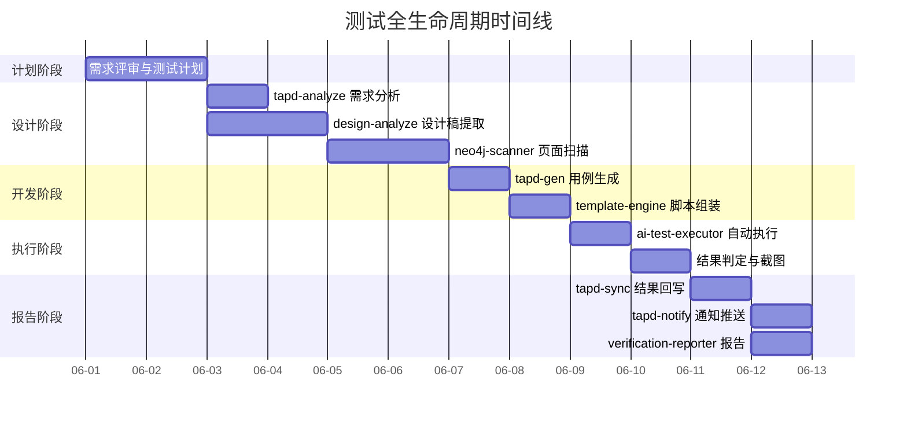

# 测试全生命周期图

## 一、测试全生命周期总图

## 二、测试生命周期与 Skills 对应表

| 阶段 | 活动 | 对应 Skill | 产出 |
|------|------|-----------|------|
| ① 计划 | 需求评审 | tapd-analyze | 需求结构化分析 |
| ② 设计 | 设计稿提取 | design-analyze | 字段约束/业务规则 |
| ③ 设计 | 页面扫描 | neo4j-scanner | Module→Page→Field 图谱 |
| ④ 设计 | 接口分析 | apifox-sync | OpenAPI 规范 |
| ⑤ 开发 | 用例生成 | tapd-gen | TAPD 测试用例 |
| ⑥ 开发 | 脚本组装 | template-engine | Playwright 脚本 |
| ⑦ 执行 | 自动执行 | ai-test-executor | 测试结果+截图 |
| ⑧ 执行 | 手动录制 | dom-recorder | 操作回放脚本 |
| ⑨ 报告 | 结果同步 | tapd-sync | TAPD 用例状态更新 |
| ⑩ 报告 | 通知推送 | tapd-notify | 企微报告 |
| ⑪ 报告 | 验证报告 | verification-reporter | 字段级比对报告 |
| ⑫ 缺陷 | Bug提报 | tapd-bug | TAPD Bug + 关联需求 |
| ⑬ 编排 | 全流程 | tapd-executor/tapd-test | 一键全自动 |

## 三、数据流转图

## 四、工具链时间线

