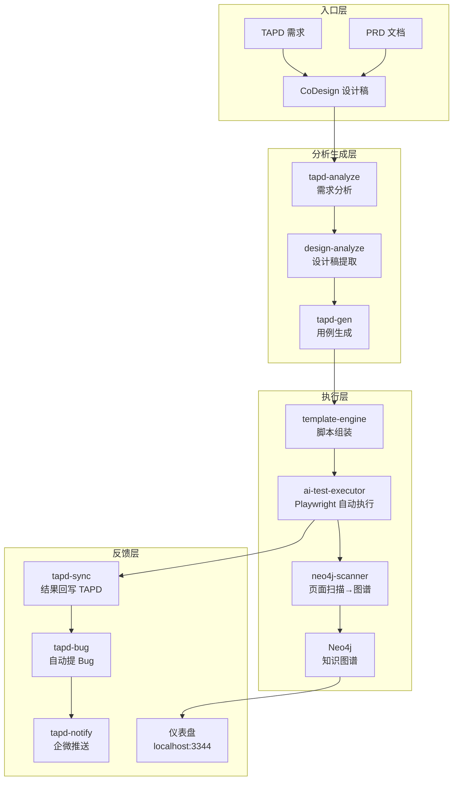
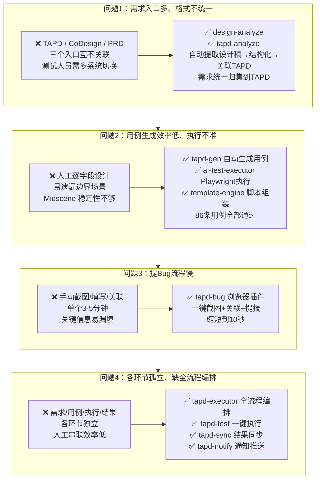

# AI 测试工具集 — 阶段性汇报

---

## 一、面临的问题与对应 Skills

### 问题 1：需求入口多、格式不统一

**现状**：需求分散在 TAPD、CoDesign 设计稿、PRD 文档等多个入口，格式不统一（有的在原型里，有的在需求描述里），测试人员需要人工翻看多个系统才能理解需求全貌。

**对应 Skills：**
- **`design-analyze`** — 自动从 CoDesign 原型提取控件标注、字段约束、业务规则，结构化后回写 TAPD 需求详情
- **`tapd-analyze`** — 从 TAPD 拉取需求详情 + 设计链接，复用 API 供其他技能调用

### 问题 2：测试用例生成效率低、执行结果不准确

**现状**：测试用例靠人工逐字段设计，耗时且容易遗漏边界场景。自动化脚本用 Midscene AI 生成，但执行稳定性不够，定位不准。

**对应 Skills：**
- **`tapd-gen`** — 按需求分析结果自动生成测试用例，写入 TAPD tcases 库
- **`ai-test-executor`** — Playwright 自动执行：填值→提交→截图→判定，实时更新 Neo4j 图谱状态
- **`template-engine`** — 标签化用例→Playwright 脚本组装

**升级路径：** Midscene AI 草稿 → Playwright 稳定定位（CSS/XPath） → 自动数据生成+边界值

### 问题 3：提 Bug 流程慢、信息不全

**现状**：测试发现 Bug 后，需要手动截图、填写标题/步骤/预期/实际、关联需求，单个 3-5 分钟，且容易漏填关键信息。

**对应 Skills：**
- **`tapd-bug`（浏览器插件）** — 一键截图 → 自动关联需求 story_id → 自动填入处理人（从开发任务获取） → 一键提交 TAPD，单个缩短到 10 秒

### 问题 4：各环节孤立、缺乏全流程编排

**现状**：需求分析、用例设计、测试执行、结果同步、通知推送各环节相互独立，人工串联效率低。

**对应 Skills：**
- **`tapd-executor`** — 全流程编排引擎
- **`tapd-test`** — 一键触发全流程
- **`tapd-sync`** — 执行结果回写 TAPD 用例状态
- **`tapd-notify`** — 企业微信推送测试报告

---

## 二、整体架构图

---

## 三、全流程编排图（tapd-executor）

```mermaid
flowchart LR
    START([用户触发 /tapd-test S-xxx]) --> A
    
    subgraph A[① 需求分析]
        A1[tapd-analyze<br>拉取需求详情+设计链接] --> A2[design-analyze<br>CoDesign 提取字段约束/注释]
        A2 --> A3[分析结果→TAPD需求描述]
    end
    
    A3 --> B
    
    subgraph B[② 用例生成]
        B1[tapd-gen<br>按分析结果生成用例] --> B2[写入 TAPD tcases 库]
    end
    
    B2 --> C
    
    subgraph C[③ 脚本组装]
        C1[template-engine<br>标签→Playwright脚本] --> C2[生成可执行脚本]
    end
    
    C2 --> D
    
    subgraph D[④ 自动执行]
        D1[ai-test-executor<br>登录/导航/填值/提交] --> D2[截图/判定]
        D2 --> D3[Neo4j 实时更新状态]
    end
    
    D3 --> E
    
    subgraph E[⑤ 结果同步]
        E1[tapd-sync<br>执行结果回写] --> E2[更新 TAPD 用例状态]
    end
    
    E2 --> F
    
    subgraph F[⑥ 通知推送]
        F1[tapd-notify<br>企微推送] --> F2[测试报告]
    end
    
    F2 --> END([完成])
```

---

## 四、问题驱动 → Skills 映射

---

## 五、当前覆盖数据

| 指标 | 数值 |
|------|------|
| 覆盖模块 | 基础数据（23页）、宣传物料管理（8页） |
| 覆盖页面 | 31 个 |
| 自动生成用例 | 903 条 |
| 已执行用例 | 86 条，通过率 100% |
| 实时监控 | Neo4j 图谱 + 仪表盘（localhost:3344） |

## 六、各环节对应的 Skills 清单

| 环节 | Skill | 状态 |
|------|-------|------|
| 需求分析 | `tapd-analyze` / `design-analyze` | ✅ |
| 用例生成 | `tapd-gen` / `ai-test-executor` | ✅ |
| 脚本组装 | `template-engine` | ✅ |
| 测试执行 | `ai-test-executor`（Playwright） | ✅ |
| Bug 提报 | `tapd-bug` 浏览器插件 | ✅ |
| 结果同步 | `tapd-sync` | ✅ |
| 通知推送 | `tapd-notify`（企微） | ✅ |
| 全流程编排 | `tapd-executor` | ✅ |
| 测试用例管理 | `test-cases` | ✅ |
| 接口文档同步 | `apifox-sync` | ✅ |

## 七、后续规划

1. **定位精度提升** — 按钮/字段识别率从 70% → 95%+
2. **全量覆盖** — 31 个页面 903 条用例全自动执行
3. **CI/CD 集成** — 接入流水线，每日自动回归
4. **数据可视化** — 执行趋势图、覆盖率统计、缺陷分布
